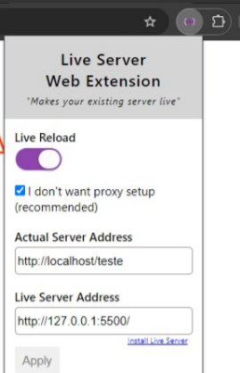

# Rodando Svelte em um projeto PHP

Este é um projeto de exemplo para rodar um projeto Svelte em um projeto PHP.

## Começando

1. Faça o clone deste repositório na pasta htdocs do seu servidor local.
1. Abra o terminal e navegue até a pasta do projeto.
1. Execute o comando `npm install` para instalar as dependências no diretório /svelte.
1. Execute o comando `npm run build` para compilar o projeto Svelte na mesma pasta.
1. Inicialize o apache e acesse o projeto pelo navegador apartir de `http://localhost`.

## Automatizando o processo de desenvolvimento

1. Instale a extensão live-server no Visual Studio Code. [Link para download](https://marketplace.visualstudio.com/items?itemName=ritwickdey.LiveServer)
1. Instale a extensão live-server web extension no Google Chrome. [Link para download](https://chromewebstore.google.com/detail/live-server-web-extension/fiegdmejfepffgpnejdinekhfieaogmj)
1. Configure a extensão do chrome com as portas do Apache e do Live Server após inicializá-lo no Visual Studio Code. neste caso a porta do Apache é 80 e a do Live Server é 5500.
    
1. Com isso, você poderá visualizar as alterações feitas no PHP em tempo real no navegador.
1. Para visualizar as alterações feitas no Svelte, basta sempre que salvar um arquivo, rodar o comando `npm run build` no terminal, com isso o live-server irá atualizar a página automaticamente após detectar o novo bundle.